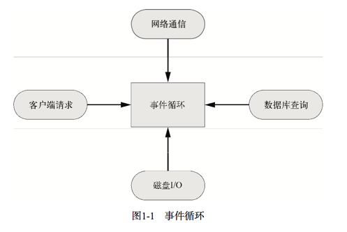

# node

## 0. introduction

- Node，是一个可以让 JavaScript 运行在服务器端的平台。

- 采用了单线程、异步式I/O、事件驱动式的程序设计模型。这些 特性不仅带来了巨大的性能提升，还减少了多线程程序设计的复杂性，进而提高了开发效率。

- Node.js 的 JavaScript 引擎是 V8，来自 Google Chrome 项目。V8 号称是目前世界上最快 的 JavaScript 引擎，经历了数次引擎革命，它的 JIT(Just-in-time Compilation，即时编译) 执行速度已经快到了接近本地代码的执行速度。

- Node.js 能做什么

    + 具有复杂逻辑的网站;
    + 基于社交网络的大规模 Web 应用;
    + Web Socket 服务器;
    + TCP/UDP 套接字应用程序; 
    + 命令行工具;
    + 交互式终端程序;
    + 带有图形用户界面的本地应用程序;
    + 单元测试工具;
    + 客户端 JavaScript 编译器。

### 0.1. 异步式 I/O 与事件驱动

- Node.js 最大的特点就是异步式 I/O(或者非阻塞 I/O)与事件紧密结合的编程模式。这 种模式与传统的同步式 I/O 线性的编程思路有很大的不同，因为控制流很大程度上要靠事件 和回调函数来组织，一个逻辑要拆分为若干个单元。

-  几个概念：
    + 阻塞:线程在执行中如果遇到磁盘读写或网络通信(统称为 I/O 操作)， 通常要耗费较长的时间，这时操作系统会剥夺这个线程的 CPU 控制权，使其暂停执行，同 时将资源让给其他的工作线程，这种线程调度方式称为 阻塞。当 I/O 操作完毕时，操作系统 将这个线程的阻塞状态解除，恢复其对CPU的控制权，令其继续执行。这种 I/O 模式就是通 常的同步式 I/O(Synchronous I/O)或阻塞式 I/O (Blocking I/O)。
    + 异步式 I/O :当线程遇到 I/O 操作时，不会以阻塞的方式等待 I/O 操作 的完成或数据的返回，而只是将 I/O 请求发送给操作系统，继续执行下一条语句。当操作 系统完成 I/O 操作时，以事件的形式通知执行 I/O 操作的线程，线程会在特定时候处理这个 事件。为了处理异步 I/O，线程必须有事件循环，不断地检查有没有未处理的事件，依次予 以处理。

- 传统多线程:为每个业务逻辑提供一个系统线程，通过系统线程切 换来弥补同步式 I/O 调用时的时间开销。

- 对于 高并发的访问，一方面线程长期阻塞等待，另一方面为了应付新请求而不断增加线程，因此 会浪费大量系统资源，同时线程的增多也会占用大量的 CPU 时间来处理内存上下文切换， 而且还容易遭受低速连接攻击。

- Node.js 使用的是单线程模型，对于所有 I/O 都采用 异步式的请求方式，避免了频繁的上下文切换。

- Node.js 在执行的过程中会维护一个事件队 列，程序在执行时进入事件循环等待下一个事件到来，每个异步式 I/O 请求完成后会被推送 到事件队列，等待程序进程进行处理。

- Node.js 的异步机制是基于事件的，所有的磁盘 I/O、网络通信、数据库查询都以非阻塞的方式请求，返回的结果由事件循环来处理。

- Node.js 进程在同一时 刻只会处理一个事件，完成后立即进入事件循环检查并处理后面的事件。这样做的好处是， CPU 和内存在同一时间集中处理一件事，同时尽可能让耗时的 I/O 操作并行执行。对于低速 连接攻击，Node.js 只是在事件队列中增加请求，等待操作系统的回应，因而不会有任何多 线程开销，很大程度上可以提高 Web 应用的健壮性，防止恶意攻击。



- 阻塞模式下，一个线程只能处理一项任务，要想提高吞吐量必须通过多线程。而非阻塞 模式下，一个线程永远在执行计算操作，这个线程所使用的 CPU 核心利用率永远是 100%， I/O 以事件的方式通知。在阻塞模式下，多线程往往能提高系统吞吐量，因为一个线程阻塞 时还有其他线程在工作，多线程可以让 CPU 资源不被阻塞中的线程浪费。而在非阻塞模式 下，线程不会被 I/O 阻塞，永远在利用 CPU。多线程带来的好处仅仅是在多核 CPU 的情况 下利用更多的核，而Node.js的单线程也能带来同样的好处。这就是为什么 Node.js 使用了单 线程、非阻塞的事件编程模式。

- 异步式 I/O 就是少了多线程的开销。对操作系统来说，创建一个线程的代价是十分昂贵的， 需要给它分配内存、列入调度，同时在线程切换的时候还要执行内存换页，CPU 的缓存被 清空，切换回来的时候还要重新从内存中读取信息，破坏了数据的局部性。


> Example

```js
const http = require('http');

http.createServer(function (req,res) {
    res.writeHead(200,{'Content-Type':'text/html'})
    res.write('<h1>hello</h1>')
    res.end('<p>world</p>')


}).listen(3000);

console.log('http server is running at port 3000');
```


